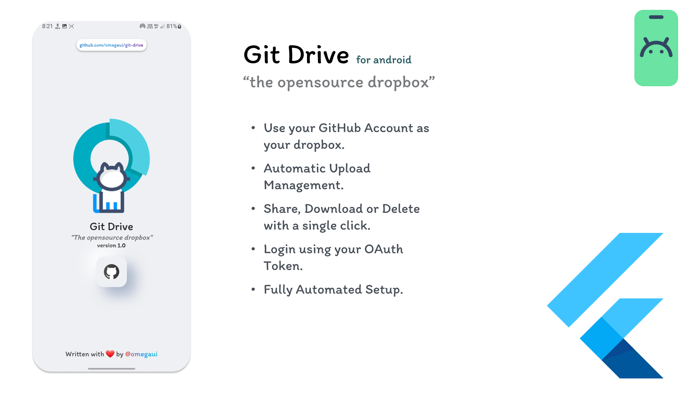
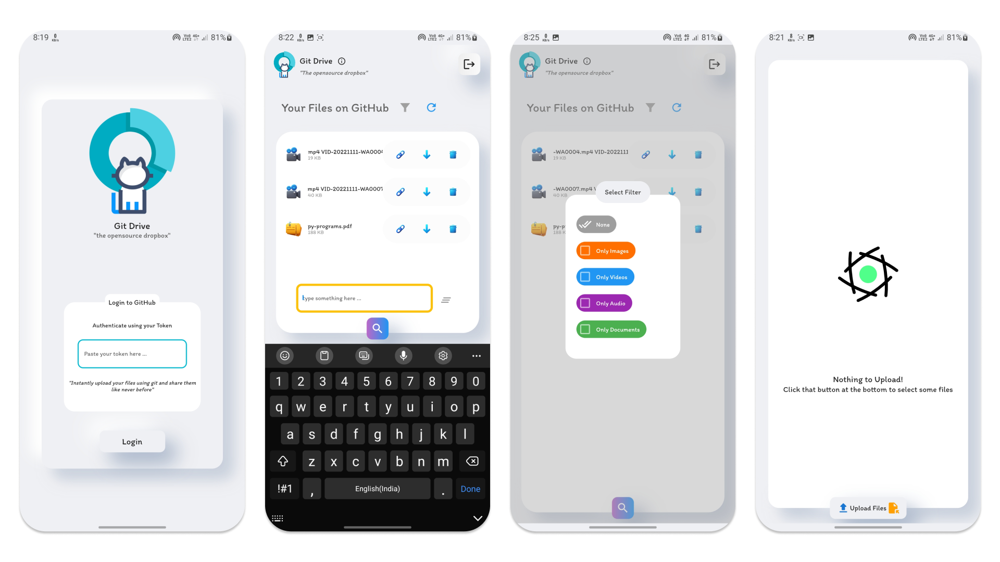

<div align="center">
    
    <h1>Git Drive</h1>
</div>

# Features
- Neumorphic App Design
- Automated Setup
- Automated File Management
- Upload Files
- Delete Files
- Share Files
- Download Files
- Search Files
- Apply File Type Filter (with extended search mode)
- Authentication using GitHub REST API

#  Concept

<div align="center">
    
</div>

Basically, this program creates a new repo called **my-git-drive** in your account and uses it for performing file related
git operations. **This program has nothing to do with other repositories in your account or collecting user info**. 
You can even go through the source code, it's pure.

This program is solely written to be able to use GitHub as an instant dropbox.

#  And _Thanks_ goes to
- [icons8.com](https://icons8.com) - All the colored icons and even the app icon belongs to icons8.com. It's a fascinating
icon store.

- **The opensource family of these dart packages that made this project a reality**
```yaml
dependencies:
  shared_preferences: ^2.0.15
  lottie: ^1.4.3
  github: ^9.6.0
  file_picker: ^5.2.2
  fluttertoast: ^8.1.1
  flutter_downloader: ^1.9.1
  path_provider: ^2.0.11
  text_scroll: ^0.1.0
  url_launcher: ^6.1.6
  flutter_native_splash: ^2.2.14
```

And also to me 😁 **[@omegaui](https://github.com/omegaui)**

